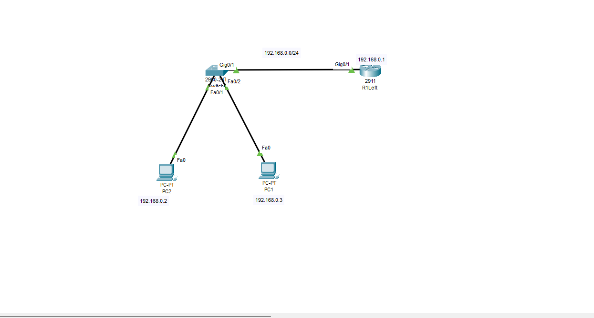
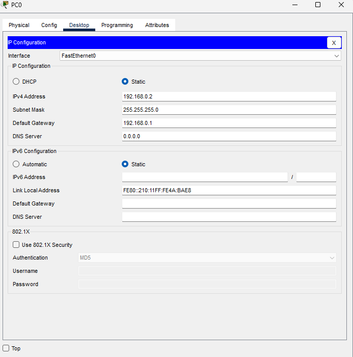
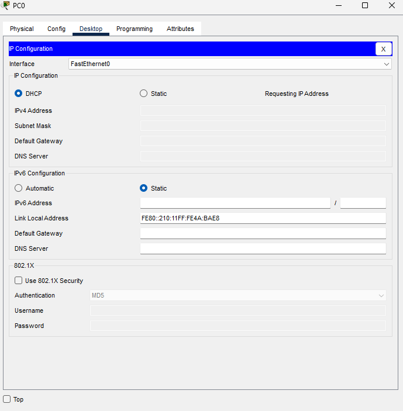
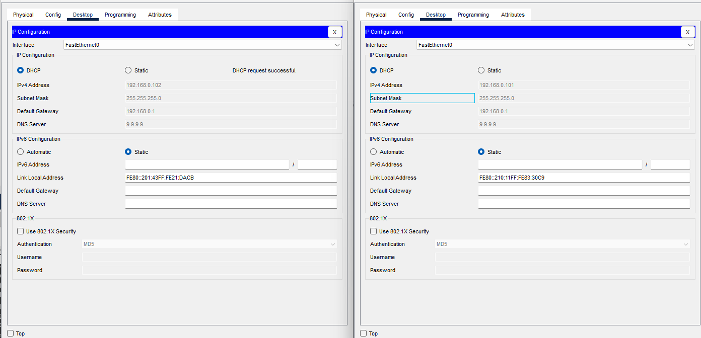

**DHCP in LAN**

A little riddle?
Ein kleines Rätsel?

**** is like a grey mouse that works hard without stopping. Several times a day, its services are used, yet no one ever thanks it.
**** ist wie eine graue Maus, die hart arbeitet, ohne anzuhalten. Mehrmals am Tag werden ihre Dienste genutzt, und trotzdem bedankt sich niemand bei ihr.

EN:
Ahojte. Today we will look at DHCP. This will be the first part: DHCP in LAN, and the second part will be the DHCP server in an external LAN.
DHCP (Dynamic Host Configuration Protocol) is a network protocol that automatically assigns IP addresses and other network settings (such as subnet mask, default gateway, and DNS server) to devices in a network. This process allows devices connected to the network, such as computers, smartphones, printers, or other devices, to obtain the necessary information to communicate on the network without needing manual configuration.
The device that provides these configurations is called a DHCP server.
DHCP works in several steps, but the basic steps are
DHCP Discover: The client (e.g., a computer) sends a broadcast request to the network to find out which server can provide an IP address.
DHCP Offer: The DHCP server responds to the request and offers the client an IP address along with other network settings (such as subnet mask, default gateway, and DNS server).
DHCP Request: The client selects one of the offered IP addresses and sends a request to the server to accept the address.
DHCP Acknowledge: The DHCP server confirms the request and assigns the IP address to the client, providing all additional configuration information.
This process usually happens very quickly and automatically
You can use the acronym DORA to remember the steps:
1.	D - Discover
2.	O - Offer
3.	R - Request
4.	A – Acknowledge


SYN-ACK:
o	SYN (Synchronize): This is the first step in the TCP three-way handshake. The client sends a packet with the SYN flag to initiate the connection.
o	SYN-ACK (Synchronize-Acknowledge): After receiving the SYN packet, the server responds with a SYN-ACK packet, which confirms the request to establish the connection and prepares the server to receive further data.
o	ACK (Acknowledge): Finally, the client sends an ACK packet, confirming the connection, and the connection is successfully established.
The entire three-way handshake process is as follows:
1.	SYN – The client initiates the connection.
2.	SYN-ACK – The server responds with confirmation.
3.	ACK – The client confirms, and the connection is established.


DE:
Ahojte. Heute schauen wir uns DHCP an. Dies wird der erste Teil sein: DHCP im LAN, und der zweite Teil wird der DHCP-Server in einem externen LAN sein.
DHCP (Dynamic Host Configuration Protocol) ist ein Netzwerkprotokoll, das automatisch IP-Adressen und andere Netzwerkeinstellungen (wie Subnetzmaske, Standardgateway und DNS-Server) an Geräte im Netzwerk zuweist. Dieser Prozess ermöglicht es Geräten, die mit dem Netzwerk verbunden sind, wie Computern, Smartphones, Druckern oder anderen Geräten, die notwendigen Informationen zu erhalten, um im Netzwerk zu kommunizieren, ohne manuell konfiguriert werden zu müssen.
Das Gerät, das diese Konfigurationen bereitstellt, wird als DHCP-Server bezeichnet
•	DHCP funktioniert in mehreren Schritten, aber die grundlegenden Schritte sind:
1.	DHCP Discover: Der Client (z. B. ein Computer) sendet eine Broadcast-Anforderung an das Netzwerk, um herauszufinden, welcher Server eine IP-Adresse bereitstellen kann.
2.	DHCP Offer: Der DHCP-Server antwortet auf die Anfrage und bietet dem Client eine IP-Adresse zusammen mit anderen Netzwerkeinstellungen (wie Subnetzmaske, Standardgateway und DNS-Server).
3.	DHCP Request: Der Client wählt eine der angebotenen IP-Adressen aus und sendet eine Anfrage an den Server, um die Adresse zu akzeptieren.
4.	DHCP Acknowledge: Der DHCP-Server bestätigt die Anfrage und weist dem Client die IP-Adresse zu, wobei alle weiteren Konfigurationsinformationen bereitgestellt werden.
Dieser Prozess erfolgt normalerweise sehr schnell und automatisch.
SYN-ACK:
o	SYN (Synchronize): Dies ist der erste Schritt im TCP-Dreifach-Handshake. Der Client sendet ein Paket mit dem SYN-Flag, um die Verbindung zu initiieren.
o	SYN-ACK (Synchronize-Acknowledge): Nachdem der Server das SYN-Paket erhalten hat, antwortet er mit einem SYN-ACK-Paket, das die Anfrage zur Verbindungsherstellung bestätigt und den Server auf den Empfang weiterer Daten vorbereitet.
o	ACK (Acknowledge): Schließlich sendet der Client ein ACK-Paket, das die Verbindung bestätigt, und die Verbindung wird erfolgreich hergestellt.
Der gesamte Drei-Wege-Handshake-Prozess sieht wie folgt aus:
1.	SYN – Der Client initiiert die Verbindung.
2.	SYN-ACK – Der Server antwortet mit einer Bestätigung.
3.	ACK – Der Client bestätigt, und die Verbindung wird hergestellt.





**Router0**
```
enable
configure terminal
hostname R1Left
interface GigabitEthernet0/1
ip address 192.168.0.1 255.255.255.0
no shutdown
exit
```

**PC0**
```
192.168.0.2
255.255.255.0
192.168.0.1
```


**PC1**
```
192.168.0.3
255.255.255.0
192.168.0.1
```        

**R1Left**
```
ping PC0 and PC1

R1Left#ping 192.168.0.2

Type escape sequence to abort.
Sending 5, 100-byte ICMP Echos to 192.168.0.2, timeout is 2 seconds:
.!!!!
Success rate is 80 percent (4/5), round-trip min/avg/max = 0/0/0 ms

R1Left#ping 192.168.0.3

Type escape sequence to abort.
Sending 5, 100-byte ICMP Echos to 192.168.0.3, timeout is 2 seconds:
.!!!!
Success rate is 80 percent (4/5), round-trip min/avg/max = 0/0/0 ms
```

**DHCP configuration - DHCP-Konfiguration**

***Router R1Left**
```
configure terminal
ip dhcp pool soho ---> "soho" is only Name of pool
network 192.168.0.0 255.255.255.0
default-router 192.168.0.1
dns-server 9.9.9.9
exit
```
9.9.9.9 It can also be a different DNS for example google
/Es kann auch eine andere DNS (zum Beispiele google) sein
```
ip dhcp excluded-address 192.168.0.2 192.168.0.100
exit
```





**Test**
```
R1Left#show ip dhcp binding 
IP address       Client-ID/              Lease expiration        Type
                 Hardware address
192.168.0.101    0010.1183.30C9           --                     Automatic
192.168.0.102    0001.4321.DACB           --                     Automatic
```
```
R1Left#ping 192.168.0.101

Type escape sequence to abort.
Sending 5, 100-byte ICMP Echos to 192.168.0.101, timeout is 2 seconds:
.!!!!
Success rate is 80 percent (4/5), round-trip min/avg/max = 0/0/0 ms

R1Left#ping 192.168.0.102

Type escape sequence to abort.
Sending 5, 100-byte ICMP Echos to 192.168.0.102, timeout is 2 seconds:
.!!!!
Success rate is 80 percent (4/5), round-trip min/avg/max = 0/0/0 ms
```

**R1Left**
```
copy run start
```


